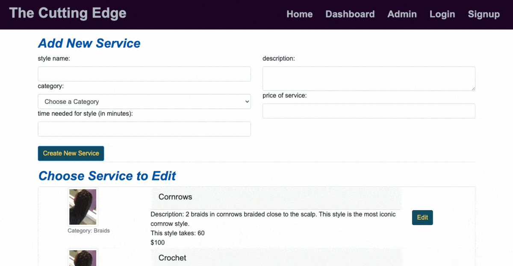

:house: The Cutting Edge  
==

Description
--
>An appointment scheduler for a hair salon using node js, SQL and material design 
>This is the completion of a group project assignment using the tecnologies listed below.

### Table of Contents
[Installation](#install) 
[Usage Information](#usage)</a> 
[Contribution Guidelines](#contribute) 
[Testing Instructions](#test) 
[Questions](#quest) 

:memo: [Installation Instructions](install)
========
>run from command terminal via node js and the command line

:computer: [Usage Information](usage)
=======
>use for scheduling appointments for a small business, target business is a hair salon 
>Example screen shots:

  

:incoming_envelope: [Contribution Guidelines](contribute)
=========
>use the issues located on the repository.   

:notebook: [Technologies used in development and testing](test)
=======
>We used the following technologies to build this scheduling app: 
>>NodeJs, Sequelize, Handlebars, Javascript, Express 
>>new technologies:  Nodemon and Sweet Alert for the popups 
>>we attempted to add a calendar feature into the app, but had difficulties implementing calendar libraries in the time we had allotted to complete this project. 

:question: [Questions](quest)
=======
>:email:Email: jd9913@gmail.com , aklobby@gmail.com, terahjequinn@gmail.com 
>GitHub Username: [jd9913](https://github.com/jd9913), [terahje](https://github.com/terahje), [aksmith5239](https://github.com/aksmith5239) 
>:link: Repository Link: https://github.com/terahje/cutting-edge 
>:link: Heroku Link--for live deployment: https://the-cutting-edge-20.herokuapp.com/  

[Licenses](#license)
=======
>This application is covered under the following license(s):  
>> 
>>click [here](https://choosealicense.com/licenses/) to read about these licenses. 

Footer
-----

Made with love :gift_heart: by jd9913, terahje, aksmith5239. :copyright: 2020
